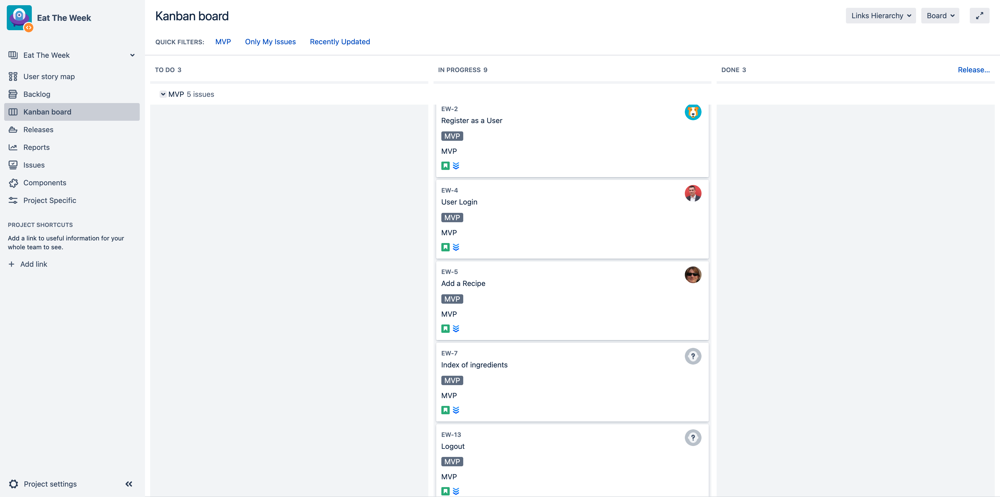
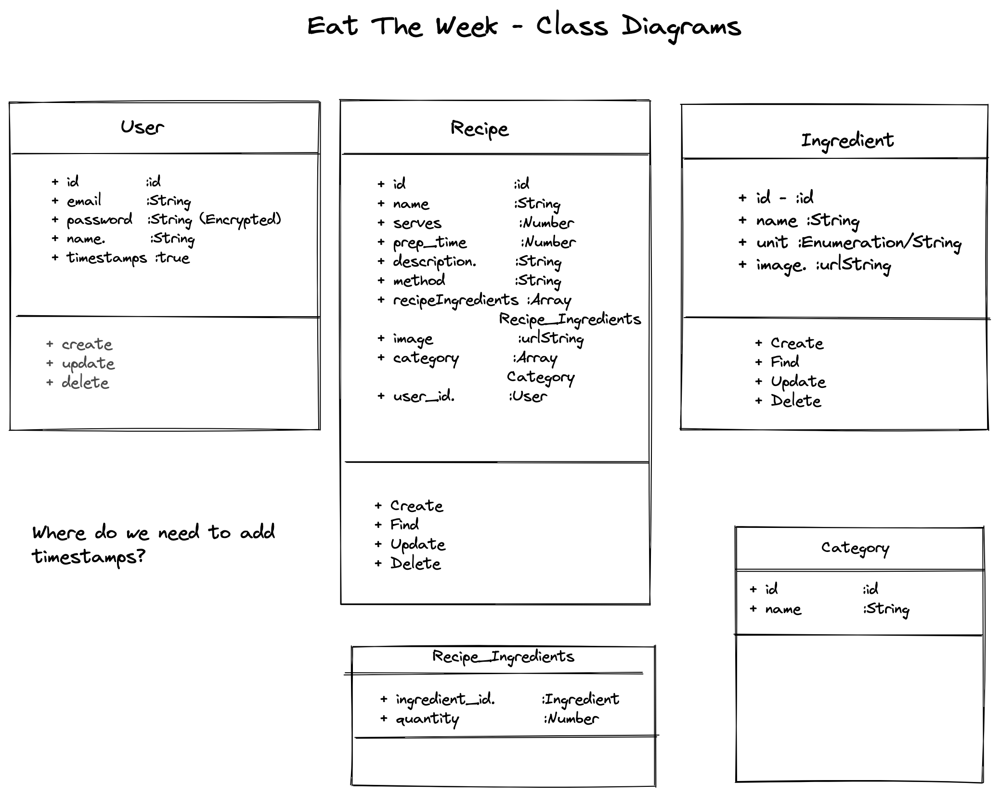

# Eat The Week
An app designed to allow users to save their favourite recipes, shop for ingredients and find new inspiration for cooking.

---

## Tech Used

- [Node](https://nodejs.org/en/) - Back End
- [MongoDB](https://www.mongodb.com/) - Database
- [Express](https://expressjs.com/) - Web framework for Node.js
- [React](https://reactjs.org/) - Front End
- [Jest](https://jestjs.io/) - Unit Testing
- [Cypress](https://www.cypress.io/) - Integration Testing
- [Prettier](https://prettier.io/) - Linting
- [Bootstrap/CSS](https://getbootstrap.com/docs/3.4/css/) - Look and Feel
- [Bcrypt](https://www.npmjs.com/package/bcrypt) - Encryption

## MVP



The functionality we expect for the MVP is:

* Sign Up

```
As a Customer
So that I can access Eat the Week
I need to be able to create an account
```

* Login

```
As a Customer
So that I can access my account
I need to be able to login to my account
```

* Logout

```
As a Customer
So that I can keep my profile secure
I want to be able to logout
```

* Show Ingredients

```
As a Customer
So that I can create tasty tasty recipes
I need to be able to see available ingredients
```

* Create Recipe

```
As a Customer
So that I can store my own recipes
I want to be able to create a recipe
```

# Future Enhancements

Longer term we would like the following functionality:

* Associate recipes with a customer profile
* Create weekly planner of meals
* Auto-add items from a recipe to the basket
* Mock checkout
* Pre-created recipes to help people be creative with their cooking!
* Make recipe selections seasonal
* Identify Vegan/Vegetarian/allergy safe recipes
* Enhanced profile (add dietary requirements)
* Handle substitutions/out of stock items


## Design Diagrams



## Installation

---

Install node via your favourite package manager if required, see [here](https://nodejs.org/en/ "Node") for more details

To install this code from the latest source

If you have SSH setup:

```
$> git clone git@github.com:nyahehnagi/eat_the_week.git
```

Otherwise:

```
$> git clone https://github.com/nyahehnagi/eat_the_week.git

```

Install package dependancies

```
// From root of project
$> npm install
// change to client directory
$> cd client
$> npm install

```

To run locally

```
// from root of project
$> npm start // this starts the express server
// In a new terminal, change directory to the react client
$> cd client
$> npm start
```

Navigate to http://localhost:3000/

## Testing

---

To run tests

```
// Jest tests
$> npx jest

//Cypress Integration tests
$> npm run test:integration

```

# REST API

## User

### POST /users

Creates a new User.

```
 curl "http://localhost:4000/users"   -X POST   -H "Content-Type: application/json"   -d '{"user": {"email":"funkyfood@food.com","password":"password", "name":"Funky Food"}}'
```

## Auth

### POST /auth

Auths a user, giving you a user_id and a token required to perform actions on behalf of the user (e.g. creating recipes).

```
curl "http://localhost:4000/auth" -X POST -H "Content-Type: application/json" -d '{"session": {"email":"funkyfood@food.com", "password":"password"}}'
```

On success, the above command returns JSON structured like this:

```
{
  "id": 1,
  "name": "your name",
  "token": "a_valid_token"
}
```

---

## Recipe

### GET /recipes

Returns a list of all recipes associated with a user.

This endpoint requires a user_id given as a token in the authorization header.

```
curl "http://localhost:4000/recipes" \
  -H "Authorization: Bearer <token_here>"
```

On success, the above command returns JSON structured like this:

[
{
"name": "sausage sandwich",
"created_at": "2018-06-23T13:21:23.317Z",
"updated_at": "2018-06-23T13:21:23.317Z"
}
]

### GET /recipes/:id

Returns a single recipe by ID

This endpoint requires a user_id given as a token in the authorization header.

```
curl "http://localhost:4000/recipes/1"  -H "Authorization: Bearer <token here>" 
```
On success, the above command returns JSON structured like this

{
  "category":"some cat",
  "_id":"1",
  "name":"eggs",
  "serves":1,
  "prep_time":1,
  "description":"testing",
  "method":"bake it",
  "ingredient":"eggs",
  "user_id":"1",
  "createdAt":"2022-04-07T21:02:13.928Z",
  "updatedAt":"2022-04-07T21:25:06.091Z",
  "__v":0,
  "image":""
}


### POST /recipes

Creates a new Recipe.

```
  curl "http://localhost:4000/recipes"   -X POST   -H "Content-Type: application/json"  -H "Authorization: Bearer <token here>" -d '{"recipe": {"name":"eggs", "serves":"1","prep_time":"1","description":"testing","method":"bake it","ingredient":"","image":"","category":"","user_id":"1" }}'
```

### PUT /recipes/:id

Updates a Recipe.

This endpoint requires a user_id given as a token in the authorization header.

```
curl "http://localhost:4000/recipes/1" -X PUT  -H "Content-Type: application/json"  -H "Authorization: Bearer <token here>" -d '{"recipe": {"name":"eggs", "serves":"1","prep_time":"1","description":"testing","method":"bake it","ingredient":"eggs","image":"","category":"some cat","user_id":"1" }}'

```
On success, the above command returns JSON structured like this

{
  "category":"some cat",
  "_id":"1",
  "name":"eggs",
  "serves":1,
  "prep_time":1,
  "description":"testing",
  "method":"bake it",
  "ingredient":"eggs",
  "user_id":"1",
  "createdAt":"2022-04-07T21:02:13.928Z",
  "updatedAt":"2022-04-07T21:25:06.091Z",
  "__v":0,
  "image":""
}


### DELETE /recipe/:id

Deletes a Recipe.

This endpoint requires a user_id given as a token in the authorization header.


curl "http://localhost:4000/recipes/1" \
  -X DELETE \
  -H "Authorization: Bearer <token_here>"
The above command returns a 204: No Content response on success.


## Ingredient

### GET /ingredients

Returns a list of all recipes.

```
curl "http://localhost:4000/ingredients" \
  -H "Authorization: Bearer <token_here>"
```

On success, the above command returns JSON structured like this:

[
{
"name":"flour",
"unit":"grams",
"image":"Default image"}
}
]

### POST /ingredients

Creates a new Ingredient.

```
  curl "http://localhost:4000/ingredients"   -X POST   -H "Content-Type: application/json"  -H "Authorization: Bearer <token here>" -d '{ ingredient: { name: 'butter', unit: 'grams' } } 
```

## Environment Configuration

For Production, setup config on Heroku for the following:

```
NODE_ENV=production
AUTH_KEY=<somesupersecretkey>
MONGODB_URL=<connectionstring_to_Prod>
```

For Local. setup config in `.env`:

```
AUTH_KEY=supersecret
```

